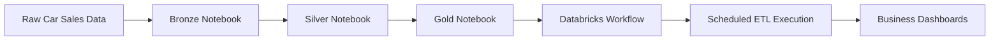

<div align="center">


</div>

---

# Project Overview

This project transforms raw automotive sales data into a structured analytics-ready data warehouse using Databricks and PySpark. The solution covers data ingestion, cleansing, transformation, dimensional modelling, analytical reporting, and automated pipeline orchestration through a Medallion Architecture implementation.

The project demonstrates how raw vehicle sales data can be converted into business-ready insights through scalable ETL workflows, dimensional modelling, SQL analytics, and workflow automation.

### Core Business Goal

Convert raw car auction and sales data into actionable insights for:

- Vehicle performance analysis
- Seller performance tracking
- Regional sales trends
- Pricing intelligence
- Time-based sales reporting

---

# Medallion Architecture Flow


## Layer Breakdown

| Layer | Purpose | Key Activities |
|---------|---------|---------|
| Bronze | Raw Data Landing | CSV ingestion, schema inference, storage |
| Silver | Refined Data Processing | Null handling, deduplication, cleansing, transformations |
| Gold | Business-Ready Analytics | Fact and dimension modelling, SQL analytics, reporting |

---

# Automated ETL Pipeline

The Medallion Architecture is operationalised through Databricks Workflows, allowing the entire ETL process to execute automatically from Bronze to Gold.

## Workflow Execution Order

| Step | Notebook | Purpose |
|---------|---------|---------|
| 1 | Bronze Layer | Raw data ingestion and cleansing |
| 2 | Silver Layer | Star schema transformation and dimensional modelling |
| 3 | Gold Layer | Analytical view generation and reporting datasets |
| 4 | Dashboard Consumption | Business reporting and KPI monitoring |

## Automation Features

| Feature | Implementation |
|---------|---------|
| Workflow Orchestration | Databricks Workflows |
| Scheduling | Automated execution |
| Dependency Management | Sequential notebook execution |
| Monitoring | Job run history tracking |
| Notifications | Success and failure email alerts |
| Compute | Serverless Job Cluster |
| Analytics Delivery | Gold Layer Reporting Views |

The automated workflow eliminates manual execution by orchestrating notebook dependencies and delivering analytics-ready datasets on schedule.

---

# Pipeline Deployment Process



## Operational Workflow

1. Raw sales data is ingested into the Bronze layer.
2. Data quality rules are applied and records are standardised.
3. Star schema dimension and fact tables are generated in Silver.
4. Gold analytical views are created for reporting.
5. Databricks Workflows orchestrate execution automatically.
6. Dashboards consume Gold-layer datasets for business analysis.

---

# Tech Stack

| Layer | Tools / Technologies | Purpose |
|---------|---------|---------|
| Data Storage | CSV | Raw and Processed Data |
| Processing | Databricks, PySpark | ETL and Transformations |
| Querying | Spark SQL, SQL | Data Analysis |
| Modelling | Star Schema | Data Warehouse Design |
| Workflow Automation | Databricks Workflows | ETL Orchestration |
| Scheduling | Databricks Jobs | Automated Execution |
| Visualisation | Databricks SQL | Reporting and Dashboards |
| Version Control | GitHub | Portfolio and Documentation |

---

# Dataset Highlights

| Feature Category | Key Fields |
|---------|---------|
| Vehicle Details | VIN, Make, Model, Trim, Body Style, Transmission |
| Sales Metrics | Selling Price, MMR, Odometer, Condition |
| Seller Details | Seller Name |
| Geographic Data | State |
| Time Data | Sale Date, Year, Month, Weekday |

---

# Star Schema Design

## Fact Table: `car_sales_fact`

| Column | Description |
|---------|---------|
| car_sales_id | Unique transaction identifier |
| vehicle_id | Vehicle foreign key |
| seller_id | Seller foreign key |
| location_id | Location foreign key |
| date_id | Date foreign key |
| selling_price | Final sale price |
| mmr | Market value reference |
| odometer | Vehicle mileage |
| condition | Vehicle condition score |

## Dimension Tables

| Dimension | Purpose |
|---------|---------|
| dim_vehicle | Vehicle attributes |
| dim_seller | Seller details |
| dim_location | Geographic location |
| dim_date | Time intelligence |

---

# Key Data Cleaning Steps

- Removed duplicate vehicle records
- Standardised date formatting
- Handled missing seller and vehicle information
- Normalised categorical values
- Generated surrogate keys for dimensional modelling
- Created time intelligence attributes
- Applied validation and transformation rules
- Prepared analytics-ready datasets

---

# Example Analytical Questions Solved

| Business Question | Insight Type |
|---------|---------|
| Which car brands sell best? | Brand Performance |
| Which states generate the highest revenue? | Geographic Trends |
| Which sellers move the most inventory? | Seller Ranking |
| How does vehicle condition impact selling price? | Pricing Strategy |
| What are monthly sales patterns? | Time-Series Analysis |
| Which vehicle categories generate the most revenue? | Product Performance |
| How do sales trends change over time? | Trend Analysis |

---

# Project Structure

```bash
car_sales_databricks_project/
│
├── bronze/
│   ├── Car Sales Data Cleaning - Bronze Layer.ipynb
│   └── car_sales_data.csv
│
├── silver/
│   ├── Vehicle Sales Star Schema.ipynb
│   ├── bronze_to_silver_transformation.ipynb
│   ├── data_cleaning.sql
│   └── car_sales_star_schema.png
│
├── gold/
│   ├── Car Sales Analytical View - Gold Layer.ipynb
│   └── Car Sales Business Analysis 30 Questions.ipynb
│
├── workflows/
│   └── Car Sales ETL Pipeline - Complete Setup Guide.ipynb
│
├── docs/
│   └── Car Sales Project Plan & Strategy.ipynb
│
└── README.md
```

---

# Business Value Delivered

This project demonstrates:

- End-to-end ETL pipeline development
- Medallion Architecture implementation
- Automated workflow orchestration
- Scheduled data processing
- Star schema dimensional modelling
- SQL analytics and reporting
- Data warehouse design principles
- Business intelligence solution development
- Production-style data engineering practices

---

# Visual Schema Reference


---

# Production Engineering Features Implemented

✔ Automated Databricks Workflow Orchestration

✔ Scheduled ETL Execution

✔ Bronze → Silver → Gold Dependency Management

✔ Serverless Compute Configuration

✔ Email-Based Job Monitoring

✔ Reusable Notebook Architecture

✔ Analytics-Ready Gold Layer Delivery

✔ Business Reporting Integration

---

# Future Enhancements

- Delta Live Tables implementation
- Incremental data loading
- Data quality monitoring framework
- Real-time streaming ingestion
- Predictive pricing analytics
- CI/CD deployment pipelines
- Automated testing and validation

---

<div align="center">

# Author

### Tshifhiwa Tshikosi

Data Analytics | Data Engineering | SQL | Databricks | Business Intelligence

Building scalable data solutions that transform raw data into actionable business insight.

</div>

