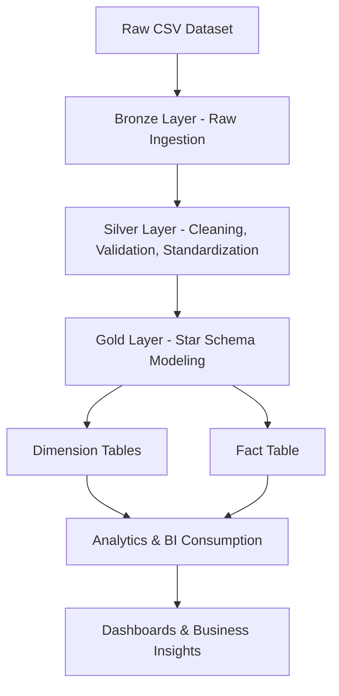

<div align="center">


</div>

---

## Project Overview

This project transforms raw automotive sales data into a structured analytics-ready data warehouse using Databricks and PySpark. The workflow covers data ingestion, cleaning, transformation, dimensional modeling, and analytical reporting through a star schema architecture optimized for business intelligence.

### Core Business Goal

Convert raw car auction and sales data into actionable insights for:

* Vehicle performance analysis
* Seller performance tracking
* Regional sales trends
* Pricing intelligence
* Time-based sales reporting

---

## Medallion Architecture Flow



### Layer Breakdown

| Layer  | Purpose                  | Key Activities                                           |
| ------ | ------------------------ | -------------------------------------------------------- |
| Bronze | Raw Data Landing         | CSV ingestion, schema inference, storage                 |
| Silver | Refined Data Processing  | Null handling, deduplication, cleansing, transformations |
| Gold   | Business-Ready Analytics | Fact & dimension modeling, SQL analytics, reporting      |

---

## Tech Stack

| Layer           | Tools / Technologies      | Purpose                   |
| --------------- | ------------------------- | ------------------------- |
| Data Storage    | CSV         | Raw + Processed Data      |
| Processing      | Databricks, PySpark       | ETL & Transformations     |
| Querying        | Spark SQL / SQL           | Analysis                  |
| Modeling        | Star Schema               | Data Warehouse Design     |
| Visualization   |  Databricks SQL | Reporting                 |
| Version Control | GitHub                    | Portfolio & Documentation |

---

## Dataset Highlights

| Feature Category | Key Fields                                       |
| ---------------- | ------------------------------------------------ |
| Vehicle Details  | VIN, Make, Model, Trim, Body Style, Transmission |
| Sales Metrics    | Selling Price, MMR, Odometer, Condition          |
| Seller Details   | Seller Name                                      |
| Geographic Data  | State                                            |
| Time Data        | Sale Date, Year, Month, Weekday                  |

---

## Star Schema Design

### Fact Table: `car_sales_fact`

| Column        | Description                   |
| ------------- | ----------------------------- |
| car_sales_id  | Unique transaction identifier |
| vehicle_id    | Vehicle foreign key           |
| seller_id     | Seller foreign key            |
| location_id   | Location foreign key          |
| date_id       | Date foreign key              |
| selling_price | Final sale price              |
| mmr           | Market value reference        |
| odometer      | Vehicle mileage               |
| condition     | Vehicle condition score       |

### Dimension Tables

| Dimension    | Purpose             |
| ------------ | ------------------- |
| dim_vehicle  | Vehicle attributes  |
| dim_seller   | Seller details      |
| dim_location | Geographic location |
| dim_date     | Time intelligence   |

---

## Key Data Cleaning Steps

* Removed duplicate vehicle entries
* Standardized date formatting
* Handled missing seller and vehicle attributes
* Normalized categorical values (state, transmission, body style)
* Created surrogate primary keys for warehouse optimization
* Structured date intelligence columns for trend analysis

---

## Example Analytical Questions Solved

| Business Question                          | Insight Type         |
| ------------------------------------------ | -------------------- |
| Which car brands sell best?                | Brand Performance    |
| Which states generate the highest revenue? | Geographic Trends    |
| Which sellers move the most inventory?     | Seller Ranking       |
| How does vehicle condition impact price?   | Pricing Strategy     |
| What are monthly sales patterns?           | Time-Series Analysis |

---


## Project Structure

```bash
car_sales_databricks_project/
│
├── bronze/
│   ├── Car Sales Data Cleaning - Bronze Layer.ipynb
│   └── car_sales_data.csv
│
├── silver/
│   ├── Vehicle Sales Star Schema.ipynb
│   ├── bronze to silver transformsion.ipynb
│   ├── data_cleaning.sql
│   └── car_sales_star_schema.png
│
├── gold/
│   ├── Car Sales Analytical View - Gold Layer.ipynb
│   └── Car Sales Business Analysis 30 Questions.ipynb
│
├── docs/
│   └── Car Sales Project Plan & Strategy.ipynb
│
└── README.md
```

---

## Business Value Delivered

### This project demonstrates:

* Real-world ETL pipeline development
* Databricks notebook workflow design
* Dimensional modeling expertise
* SQL analytics problem-solving
* Data storytelling through warehouse architecture
* Portfolio-ready data engineering execution

---

## Visual Schema Reference


---

## Future Enhancements

* Delta Live Tables automation
* Full Medallion architecture orchestration
* Incremental ETL scheduling
* Real-time streaming ingestion
* Predictive pricing models
* Data quality monitoring across Bronze, Silver, Gold layers

---

<div align="center">

## Author

### Tshifhiwa Tshikosi

Data Analytics | Data Engineering | SQL | Databricks | BI Development

Building projects that turn raw data into strategic insight.

</div>


